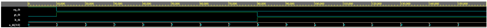
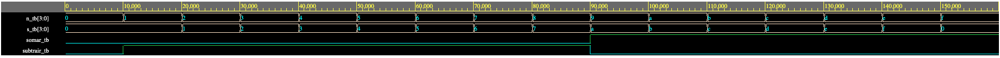
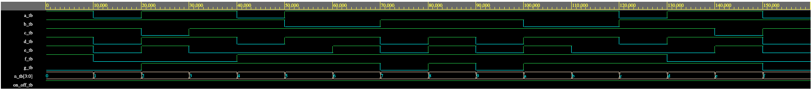
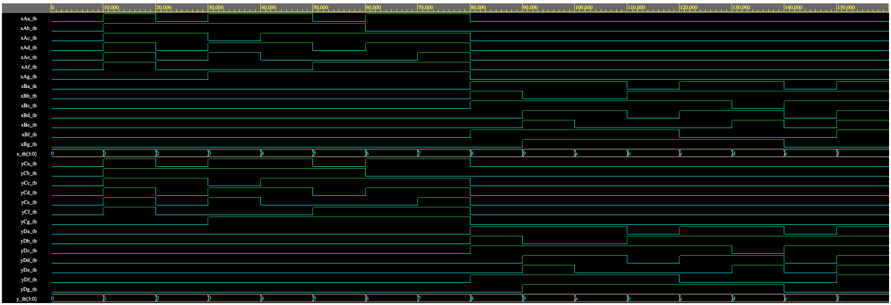

# Problema

Assuma um circuito que tem 2 entradas (X,Y) com números em C-2 de 4 bits e 4 saídas (A,B,C,D), cada uma conectada a um display de 7 segmentos.

O circuito deverá implementar as seguintes operações:

1. se X-- > 0 mostrar o valor do modulo de X em decimal no display da saída A
2. se X++ < 0 mostrar o valor do modulo de X em decimal no display da saída B
3. se Y-- > 0 mostrar o valor do modulo de Y em decimal no display da saída C
4. se Y++ < 0 mostrar o valor do modulo de Y em decimal no display da saída D

Deverá ser entregue:

- VHDL estrutural do circuito, com componentes;
- simulações de diferentes valores para X e Y; e
- Relatório com diagrama de blocos, explicação do funcionamento do circuito e resultados de simulações.

# Solução

## Diagrama do circuito

Neste circuito foram demonstradas as entradas `X` e `Y` do tipo `STD_LOGIC_VECTOR(3 DOWNTO 0)`. Consequentemente, as saídas para os display `A` e `B`, correspondentes à entrada `X`; e `C` e `D`, correspondentes à entrada `Y`.

## comparador

## somador_subtrator

## decodificador

## Circuito completo

